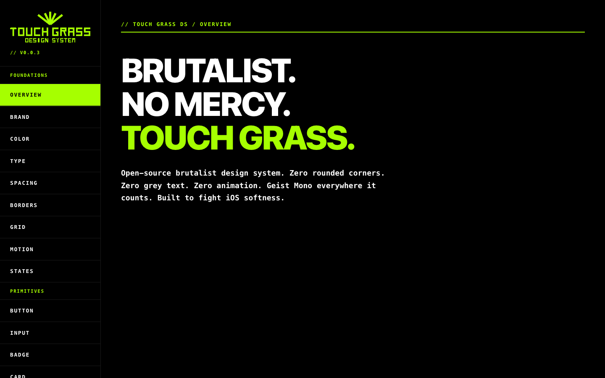
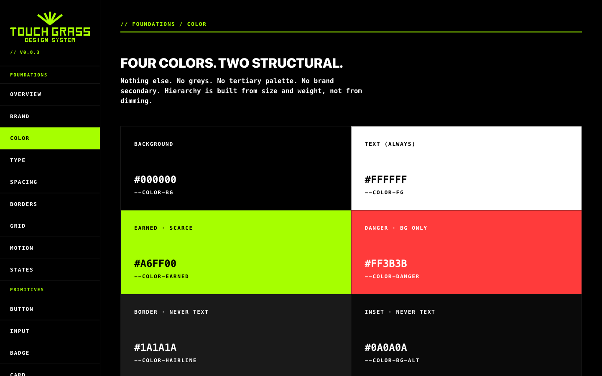
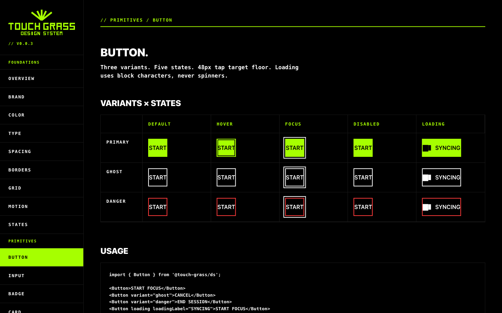
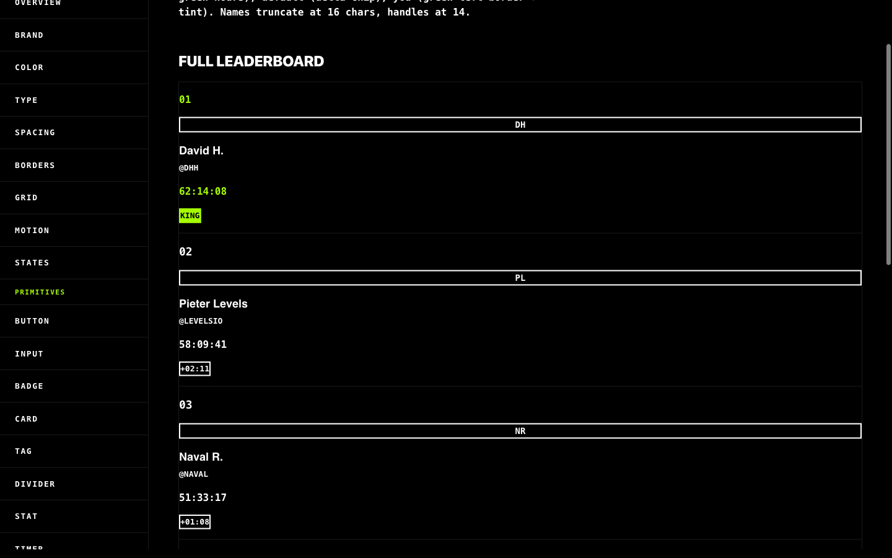

<div align="center">

# TOUCH GRASS // DESIGN SYSTEM

**Open-source brutalist design system for products that refuse to whisper.**
Zero rounded corners. Zero animation. Token-driven neutral hierarchy. Geist Mono everywhere it counts.

[](./LICENSE)
[](./package.json)
[](./.github/workflows/ci.yml)
[](https://www.npmjs.com/package/@touch-grass-ds/react)
[](https://www.npmjs.com/package/@touch-grass-ds/tokens)
[](https://www.figma.com/community/file/1625695815996602388/touch-grass-ds)

By [Thiago Xikota](https://thiagoxikota.com) · [Portfolio](https://thiagoxikota.com) · [Case study](https://thiagoxikota.com/projects/touch-grass) · [Timeouts.app](https://timeouts.app)

</div>

---

<p align="center">
  
</p>

## The vibe (non-negotiable)

Most design systems are polite.
Touch Grass is precise.

1. **No rounded corners.** `border-radius: 0` is law.
2. **No gray text.** If it's not a token, it's not UI.
3. **No motion.** State changes snap; they don't dance.
4. **Mono where it matters.** `Geist Mono` for controls, stats, timers, command tone.
5. **48px minimum tap target.** Always thumb-safe.
6. **Tokens only.** No rogue hex values inside components.

This system was built as the visual engine for [Timeouts](https://timeouts.app): a social gym for less screen time.

## What's inside this machine

| Package | Purpose |
|---|---|
| [`@touch-grass-ds/tokens`](./packages/tokens) | Style Dictionary source of truth. Ships CSS vars, Tailwind v4 `@theme`, W3C `figma-tokens.json`, and Swift constants (SPM). |
| [`@touch-grass-ds/react`](./packages/ds) | React 19 library with primitives + patterns built on brutalist rules. |
| [`packages/docs-site`](./packages/docs-site) | Vite + React docs site at `localhost:5173`, published at [timeouts.app/touch-grass](https://timeouts.app/touch-grass/). |

## Visual proof

<table>
<tr>
<td width="50%"></td>
<td width="50%"></td>
</tr>
<tr>
<td colspan="2"></td>
</tr>
</table>

## 60-second quickstart

```bash
# install
pnpm add @touch-grass-ds/tokens @touch-grass-ds/react
```

```css
/* app/globals.css */
@import "@touch-grass-ds/tokens"; /* or "@touch-grass-ds/tokens/tailwind" */
@import "@touch-grass-ds/react/styles/base.css";
```

```tsx
import { Button } from "@touch-grass-ds/react";

export function Home() {
  return <Button variant="primary">START</Button>;
}
```

## iOS / Swift

Add this repository in Xcode via Swift Package Manager:

```text
https://github.com/thiagoxikota/touch-grass
```

Use tokens in Swift:

```swift
import TouchGrassTokens

let accent = TouchGrassTokens.Color.earned
```

## Documentation

Full docs: [**timeouts.app/touch-grass**](https://timeouts.app/touch-grass) *(coming soon)*

**Design system contract:** [`docs/contract.md`](./docs/contract.md) — the normative specification covering color rules, motion bans, state model, accessibility, typography, `asChild` semantics, and enforcement. Uses MUST/SHOULD/MAY language per RFC 2119.

## Local dev

```bash
corepack enable
corepack pnpm install
corepack pnpm tokens   # build token outputs first
corepack pnpm dev      # docs site on http://localhost:5173
```

Workspace commands:

```bash
corepack pnpm -r test
corepack pnpm -r build
```

## Repo layout

```text
touch-grass/
├── packages/
│   ├── tokens/       @touch-grass-ds/tokens
│   ├── ds/           @touch-grass-ds/react
│   └── docs-site/    docs app
├── brand/            brand assets
├── docs/             specs + superpowers
├── .github/          CI + issue templates + README assets
├── Package.swift     SPM entry point
└── package.json      workspace root
```

## Roadmap

- [x] `v1.0.0` stable release (tokens + react package + docs + figma + npm)
- [ ] `v1.1.0` select/combobox + chart primitives + expanded foundations docs

## Where to use / where to get it

- npm: [`@touch-grass-ds/react`](https://www.npmjs.com/package/@touch-grass-ds/react) · [`@touch-grass-ds/tokens`](https://www.npmjs.com/package/@touch-grass-ds/tokens)
- Figma Community: [Touch Grass DS](https://www.figma.com/community/file/1625695815996602388/touch-grass-ds)
- Swift Package: [thiagoxikota/touch-grass](https://github.com/thiagoxikota/touch-grass)

## Contributing

Read [CONTRIBUTING.md](./CONTRIBUTING.md) first, especially the brutalist rules and component lockstep workflow.

## License

[MIT](./LICENSE) © [Thiago Xikota](https://thiagoxikota.com)
